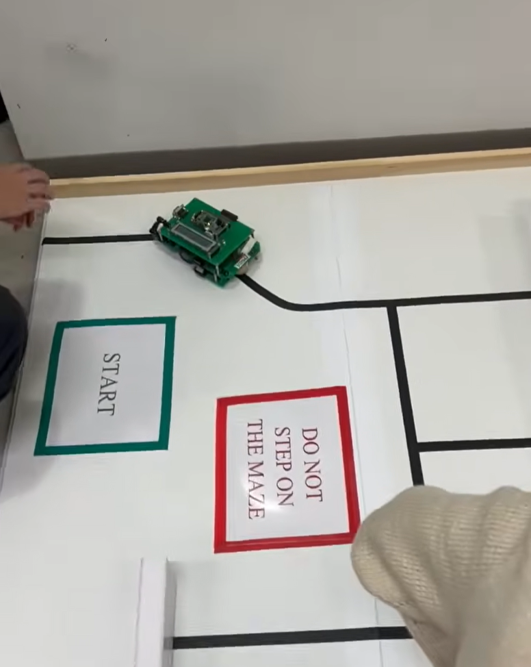

# EEBOT Maze Runner — HCS12 Assembly

An autonomous maze-navigating robot programmed in HCS12 assembly using Freescale CodeWarrior. The robot uses IR sensors and bump switches to detect walls and navigate through a maze, with real-time battery voltage and state feedback on an LCD display.

## How It Works

The robot runs a continuous main loop: power the IR emitters, sample all 5 sensors, update the LCD, then dispatch to the current state handler. A Timer Overflow interrupt fires at ~23 Hz to drive turn timing.

Navigation is sensor-driven — the robot compares each IR reading against a calibrated baseline and variance threshold to decide whether to go straight, correct its heading, or turn.

## Robot States

| State | Behaviour |
|-------|-----------|
| `START` | Idle — waits for the bow bumper to be released before moving |
| `FWD` | Driving forward — monitors sensors for obstacles and drift |
| `LEFT_TRN` | Turning left until the bow sensor clears |
| `RIGHT_TRN` | Turning right until the bow sensor clears |
| `LEFT_ALIGN` | Fine correction left to re-centre on the path |
| `RIGHT_ALIGN` | Fine correction right to re-centre on the path |
| `REV_TRN` | Reverses then turns right after a front collision |
| `ALL_STOP` | Motors off — triggered by a stern bump |

## Sensors

The robot has 5 IR sensors read via the ATD module:

| Sensor | Location | Purpose |
|--------|----------|---------|
| `SENSOR_LINE` | Bottom centre | Detects the floor line |
| `SENSOR_BOW` | Front | Detects forward obstacles |
| `SENSOR_MID` | Centre | Detects obstacles ahead |
| `SENSOR_PORT` | Left side | Detects left-side obstacles |
| `SENSOR_STBD` | Right side | Detects right-side obstacles |

Each sensor has an independently tuned variance threshold. If a reading deviates from its baseline by more than the threshold, the control logic reacts accordingly.

## Hardware

- **MCU:** Freescale HCS12 (9S12C32)
- **Board:** EEBOT robot platform
- **Display:** HD44780-compatible 2×20 LCD (4-bit interface via PORTB + PTJ)
- **Motors:** Two DC motors driven via PORTA direction bits and PTT PWM outputs
- **Sensors:** 5× IR reflectance sensors on AN0–AN4 (ATD module)
- **Bump switches:** PORTAD0 digital inputs

## LCD Display

- **Line 1:** Battery voltage in volts (e.g. `Battery volt 12.3`)
- **Line 2:** Current state name (e.g. `fwd`, `LeftTurn`, `all_stp`)

Voltage is derived from the ATD ch0 reading using: `V(mV) = result × 39 + 600`

## Project Structure

```
Project/
└── Sources/
    └── main.asm    # All robot logic in a single absolute assembly file
```

## Tools

- **IDE:** Freescale CodeWarrior for HCS12
- **Language:** HCS12 Assembly (absolute, single-file)
- **Target:** Freescale 9S12C32 microcontroller

## Demo
[Watch the demo](https://youtube.com/shorts/WfI_smUwLBY?si=WDBUtu6Xvxol7ZI9)


